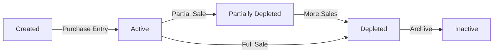

## Overview

The Batch Tracking system implements First-In-First-Out (FIFO) inventory management at the batch level. Each purchase creates a unique batch with its own quantity, cost, and expiration tracking.

<Info>
  Batch tracking enables precise cost accounting, expiration management, and supplier traceability for all inventory items.
</Info>

## Batch Data Model

Each batch represents a specific purchase lot of a product:

<CodeGroup>
```python backend/Product/Domain/batch.py
class Batch(Base, AuditableEntity):
    __tablename__ = "batches"

    id = Column(String(50), primary_key=True, index=True)
    product_id = Column(String(50), ForeignKey("products.id"), nullable=False)
    initial_quantity = Column(Integer, nullable=False)
    available_quantity = Column(Integer, nullable=False)
    unit_cost = Column(Float, nullable=False)
    purchase_date = Column(DateTime, nullable=False)
    expiration_date = Column(DateTime, nullable=True)
    supplier_id = Column(String(50), nullable=True)
    entry_transaction_ref = Column(String(100), nullable=True)
```
</CodeGroup>

### Batch Attributes

<ParamField path="id" type="string" required>
  Unique batch identifier (UUID)
</ParamField>

<ParamField path="product_id" type="string" required>
  Reference to the product being stocked
</ParamField>

<ParamField path="initial_quantity" type="integer" required>
  Original quantity purchased in this batch
</ParamField>

<ParamField path="available_quantity" type="integer" required>
  Current remaining quantity (updated as sales occur)
</ParamField>

<ParamField path="unit_cost" type="float" required>
  Cost per unit paid to supplier (used for COGS calculation)
</ParamField>

<ParamField path="purchase_date" type="datetime" required>
  When the batch was received into inventory
</ParamField>

<ParamField path="expiration_date" type="datetime">
  Expiration date for perishable products (null for non-perishables)
</ParamField>

<ParamField path="supplier_id" type="string">
  Reference to the supplier who provided this batch
</ParamField>

## Receiving Inventory (Creating Batches)

When inventory is purchased, a new batch is created through the purchase entry workflow:

<CodeGroup>
```python backend/Product/Adapters/batch_controller.py
@router.route('/receive', methods=['POST'])
@require_role('admin', 'gestor')
def receive_purchase():
    data = request.get_json()
    
    expiration_date = None
    if data.get('expiration_date'):
        expiration_date = datetime.fromisoformat(
            data['expiration_date'].replace('Z', '+00:00')
        )

    batch, mov = stock_svc.register_entry(
        product_id=data.get('product_id'),
        quantity=int(data.get('quantity')),
        unit_cost=float(data.get('unit_cost')),
        supplier_id=data.get('supplier_id'),
        expiration_date=expiration_date
    )
    
    return jsonify({...}), 201
```
</CodeGroup>

### API Endpoint

<Card title="Receive Purchase" icon="truck-ramp-box" href="/api/batches/create">
  **POST** `/api/v1/batches/receive`
  
  Creates a new inventory batch from a purchase.
</Card>

<RequestExample>
```json Request
{
  "product_id": "uuid-product",
  "quantity": 100,
  "unit_cost": 12.50,
  "supplier_id": "uuid-supplier",
  "expiration_date": "2025-12-31T00:00:00Z"
}
```

```json Response
{
  "id": "batch-uuid",
  "product_id": "uuid-product",
  "initial_quantity": 100,
  "available_quantity": 100,
  "unit_cost": 12.50,
  "purchase_date": "2026-03-04T10:30:00Z",
  "expiration_date": "2025-12-31T00:00:00Z",
  "supplier_id": "uuid-supplier",
  "entry_transaction_ref": "mov-uuid"
}
```
</RequestExample>

## FIFO Algorithm

The system uses First-In-First-Out (FIFO) logic to automatically select which batches to deduct from during sales:

<Steps>
  <Step title="Sort Batches">
    For perishable products: Sort by expiration date (earliest first)
    
    For non-perishables: Sort by purchase date (oldest first)
  </Step>
  
  <Step title="Deduct Quantity">
    Start deducting from the first batch until it's depleted
  </Step>
  
  <Step title="Move to Next Batch">
    If more quantity is needed, continue to the next batch in the sorted order
  </Step>
  
  <Step title="Calculate COGS">
    Sum the weighted cost from all batches used: `total_cost = Σ(quantity_used × batch.unit_cost)`
  </Step>
</Steps>

### FIFO Implementation

<CodeGroup>
```python backend/Product/Domain/stock_service.py
def register_exit(self, product_id: str, quantity: int, 
                 unit_price: Optional[float] = None, notes: str = "") -> Tuple[Movement, float]:
    # Get active batches sorted by expiration/purchase date
    batches = self.repo.get_batches_by_product(product_id, active_only=True)
    
    # Sort: expiration date first (if exists), then purchase date
    max_date = datetime.max.replace(tzinfo=timezone.utc)
    batches.sort(key=lambda b: (
        b.expiration_date.replace(tzinfo=timezone.utc) if b.expiration_date else max_date, 
        b.purchase_date.replace(tzinfo=timezone.utc) if b.purchase_date else max_date
    ))

    # Check sufficient stock
    total_available = sum(b.available_quantity for b in batches)
    if total_available < quantity:
        raise HTTPException(status_code=400, detail="Insufficient stock")

    # Deduct from batches using FIFO
    remaining_to_deduct = quantity
    total_cost = 0.0
    affected_batches = []

    for batch in batches:
        if remaining_to_deduct <= 0:
            break
        
        deduct_amount = min(batch.available_quantity, remaining_to_deduct)
        batch.available_quantity -= deduct_amount
        remaining_to_deduct -= deduct_amount
        total_cost += deduct_amount * batch.unit_cost
        affected_batches.append(batch.id)
```
</CodeGroup>

<Note>
  For perishable products, this algorithm implements FEFO (First Expired, First Out) by prioritizing batches with earlier expiration dates.
</Note>

## Batch Lifecycle

Batches go through several states during their lifecycle:



### Batch States

<AccordionGroup>
  <Accordion title="Active" icon="check" iconType="solid">
    Batch has `available_quantity > 0` and is available for sales
  </Accordion>
  
  <Accordion title="Partially Depleted" icon="chart-simple">
    Batch has been used for some sales but still has remaining quantity
  </Accordion>
  
  <Accordion title="Depleted" icon="circle-xmark">
    Batch has `available_quantity = 0`, no longer used in FIFO calculations
  </Accordion>
</AccordionGroup>

## Viewing Batches

Query all batches for a specific product:

<CodeGroup>
```python backend/Product/Adapters/batch_controller.py
@router.route('/product/<product_id>', methods=['GET'])
@require_role('admin', 'gestor', 'consultor')
def get_batches_by_product(product_id):
    active_only = request.args.get('active_only', 'true').lower() == 'true'
    
    batches = repo.get_batches_by_product(product_id, active_only)
    return jsonify(result), 200
```
</CodeGroup>

### Query Parameters

<ParamField query="active_only" type="boolean" default="true">
  Filter to only show batches with available quantity > 0
</ParamField>

<Card title="Get Batches by Product" icon="magnifying-glass" href="/api/batches/list">
  **GET** `/api/v1/batches/product/{product_id}`
  
  Retrieves all batches for a specific product.
</Card>

## Cost of Goods Sold (COGS)

Batch tracking enables accurate COGS calculation for each sale:

<Steps>
  <Step title="Identify Affected Batches">
    Determine which batches will be used to fulfill the sale quantity using FIFO
  </Step>
  
  <Step title="Calculate Weighted Cost">
    For each batch: `batch_cost = quantity_from_batch × batch.unit_cost`
  </Step>
  
  <Step title="Sum Total COGS">
    `total_cogs = Σ batch_cost` across all affected batches
  </Step>
  
  <Step title="Record in Movement">
    Store the calculated COGS in the movement's `total_cost` field
  </Step>
</Steps>

### Example COGS Calculation

<Info>
  **Scenario:** Selling 150 units when you have:
  - Batch A: 100 units @ Bs 10.00 each
  - Batch B: 200 units @ Bs 12.00 each
  
  **FIFO Selection:**
  - Use all 100 from Batch A: 100 × 10.00 = Bs 1,000.00
  - Use 50 from Batch B: 50 × 12.00 = Bs 600.00
  
  **Total COGS:** Bs 1,600.00
  
  **Average Cost per Unit:** 1,600 ÷ 150 = Bs 10.67
</Info>

## Supplier Traceability

Each batch can be linked to a supplier for complete traceability:

<CodeGroup>
```jsx frontend/src/Product/UI/pages/PurchaseEntryPage.jsx
<StakeholderSearchBar
    type="supplier"
    placeholder="Buscar proveedor..."
    onSelect={(id) => setFormData({ ...formData, supplier_id: id || '' })}
/>
```
</CodeGroup>

### Benefits of Supplier Tracking

<CardGroup cols={2}>
  <Card title="Quality Issues" icon="triangle-exclamation">
    Quickly identify all batches from a supplier if quality problems arise
  </Card>
  
  <Card title="Cost Analysis" icon="chart-line">
    Compare costs across different suppliers for the same product
  </Card>
  
  <Card title="Recall Management" icon="rotate-left">
    Efficiently handle product recalls by supplier and batch
  </Card>
  
  <Card title="Supplier Performance" icon="star">
    Track which suppliers provide the best quality and pricing
  </Card>
</CardGroup>

## Expiration Management

For perishable products, batch-level expiration tracking is critical:

<Warning>
  The system automatically prioritizes batches with earlier expiration dates to minimize waste from expired inventory.
</Warning>

### Expiration Workflow

1. **Set expiration date** when receiving inventory
2. **FEFO sorting** automatically uses soon-to-expire batches first
3. **Dashboard alerts** warn about products approaching expiration
4. **Manual adjustments** can write off expired inventory

## Best Practices

<AccordionGroup>
  <Accordion title="Always Link Suppliers">
    Associate each batch with a supplier for full traceability and better supplier management.
  </Accordion>
  
  <Accordion title="Set Accurate Costs">
    Enter the actual unit cost paid to ensure accurate COGS and profit margin calculations.
  </Accordion>
  
  <Accordion title="Track Expiration Dates">
    For perishable products, always set expiration dates to enable FEFO and reduce waste.
  </Accordion>
  
  <Accordion title="Monitor Batch Depletion">
    Regularly review batch status to identify slow-moving inventory.
  </Accordion>
  
  <Accordion title="Use Transaction References">
    The `entry_transaction_ref` links batches to their purchase movements for audit trails.
  </Accordion>
</AccordionGroup>

## Integration with Movements

Batches are tightly integrated with the stock movement system:

- **ENTRY movements** create new batches
- **EXIT movements** deduct from batches using FIFO
- **ADJUSTMENT movements** can modify batch quantities

See [Stock Movements](/features/stock-movements) for detailed information on inventory transactions.

## Related Documentation

<CardGroup cols={3}>
  <Card title="Product Management" icon="box" href="/features/product-management">
    Learn about product catalog setup
  </Card>
  
  <Card title="Stock Movements" icon="arrows-turn-to-dots" href="/features/stock-movements">
    Understand inventory transactions
  </Card>
  
  <Card title="Stakeholder Management" icon="users" href="/features/stakeholder-management">
    Manage suppliers and customers
  </Card>
</CardGroup>
